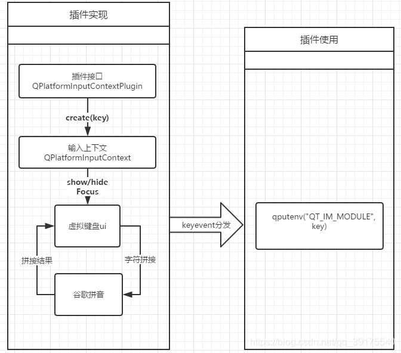

Qt
==================

Meta-object system
---------------------
this is based on three things:

- QObject
    root of any
- Q_OBJECT
    properties, signals and slots
- moc     
    complier, this will compile a new file to store meta object information, 
    It can be understood in this way, a class usage table is described, the establishment of class names, method names, etc.

Qt Objct
^^^^^^^^^^^^^^^^^^
.. code::

    class WorkerImpl;
    class GentWater : public QObject
    {
        Q_OBJECT
        Q_PROPERTY(bool m_ok READ ok WRITE setOk NOTIFY okChanged)
    public:
        GentWater(QObject* parent = nullptr);
        virtual ~GentWater();

        enum role{
            NA,
            A
        };
        Q_ENUM(role)

        Q_INVOKABLE void justTry();

        const bool ok() const;
        void setOk(bool newOk);

    signals:
        void okChanged();

    public slots:
        void onGetSome();
        
    private:
        WorkerImpl* m_worker;
        bool m_ok;
    };

    class Lighter
    {
        //Q_GADGETs can have Q_ENUM, Q_PROPERTY and Q_INVOKABLE, but they cannot have signals or slots.
        Q_GADGET

        //export property ok
        Q_PROPERTY(bool m_ok READ ok)
    public:
        Lighter() = default; // very very
        const ok() const { return m_ok; }
        bool m_ok{false};
    };
    //declare meta type
    Q_DECLARE_METATYPE(Lighter)

Signal& Slots
^^^^^^^^^^^^^^^^^^^^^
.. code::

    connect(pSender, static_cast<void(Sender::*)(int)>(&Sender::sig_sendData),
            pGeter,  static_cast<void(Geter::*)(int)>(&Geter::slot_getData));
    
    // Register customs data
    qRegisterMetaType<Data>("Data");
    qRegisterMetaType<Data>("Data &");
    qRegisterMetaType<Data>("Data *");
    connect(pSender, &Sender::sig_sendCusData, pGeter, &Geter::slot_getCusData, Qt::QueuedConnection);
    
    // C++11 lambda
    connect(pSender, &Sender::sig_sendCusData, {
    });
 
    auto fun = std::function<void(Data)>{
    };
    connect(pSender, &Sender::sig_sendCusData, fun);

QVar
^^^^^^^^^^^^^^^
.. code::

    class CusVar{
    public:
        CusVar(){}
        CusVar(const CusVar &other){info = other.info;}
        ~CusVar(){}
    
        void operator = (const CusVar &other){
            info = other.info;
        }
    
        QString getInfo(){return info;}
    private:
        QString info = "123";
    };
    Q_DECLARE_METATYPE(CusVar)

        在QVariant使用中
    
    QVariant varData;
    // default
    CusVar var;
    // copy
    varData.setValue(var);
 
    // default
    CusVar getVar;
    // copy =
    getVar = varData.value<CusVar>();
    qDebug() << "get cusVar" << getVar.getInfo();
 
    // copy
    CusVar getVarEx = varData.value<CusVar>();
    qDebug() << "get cusVarEx" << getVarEx.getInfo();

Event
-------------------------
Qt framework is event driven.
For general incident resolution, you can start with the following:

- paintEvent、mousePressEvent...
- QObject.event
- QObject.eventFilter
- addEvent

    + registerEventType

    + postevent (good)

        event must be allocated on the heap, this will be delete by Qt when it has been posted.
        post to queue will return immediately

    + sendevent (bad)

        create the event on the stack
        sent to receiver

Thread
---------------------
move to Thread
^^^^^^^^^^^^^^^^^^^^^
1. Subclasses inherited from QObject can use the moveToThead method
2. The parent of the object cannot be specified, that is, parent = nullptr
3. Connect through signals and slots, (from Qt help document )If the receiver lives in the thread that emits the signal, Qt::DirectConnection is used. Otherwise, Qt::QueuedConnection is used.

ObjectTree
---------------------
The object tree solves the memory management problem very well, and only needs to specify the parent class. That is, when the parent class is finally cancelled, this will recursively find all children and destroy them
 
Widget & Painter
---------------------
For widgets, everything is paint.
We define the properties of the drawing control, and we can use timers, animations or other update attributes to trigger paintEvent.
Or use native space layout plus qss to implement complex GUI.

Quick & qml
---------------------
1. GUI
2. MVC

Opengl
---------------------
QOpenGLWidget + Opengl api + no qt openglfunctions

Using QOpenGLWidget is like using widgets. You only need to deal with these three virtual methods

- initializeGL  
    set up Opengl resources and state
- paintGL
    Opengl render, called by and update
- resizeGL
    update viewport and projection

The user output of the upper level of the GUI can be obtained through general events, 
and then processed to update the opengl state.

.. note::

    It is best to separate the opengl related packages, so that they can be used in widgets and qml.

Process
---------------------
Use this to start the process, and you can get output or input.

QProcess start path with space

.. code::

    QProcess process;
    process.start("/A BCD/e.exe", QStringList());

Translation
----------------------

Keyboard
----------------------

Plugin
----------------------
