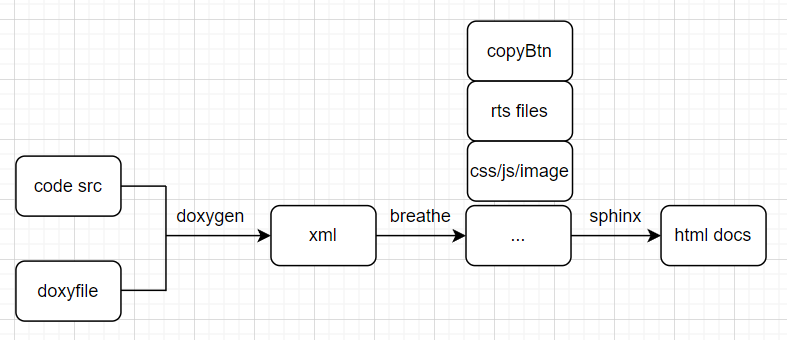

Code
=============
Use doxygen, breathe, sphinx to generate documents.

MainProcess
---------------------

Support
--------------------
More can see `breathe <https://www.breathe.readthedocs.io>`_
Returns the appropriate breathe restructured text directive for the specified kind.
The output for a given kind is as follows:

    +-------------+--------------------+
    | Input Kind  | Output Directive   |
    +=============+====================+
    | "class"     | "doxygenclass"     |
    +-------------+--------------------+
    | "define"    | "doxygendefine"    |
    +-------------+--------------------+
    | "enum"      | "doxygenenum"      |
    +-------------+--------------------+
    | "enumvalue" | "doxygenenumvalue" |
    +-------------+--------------------+
    | "file"      | "doxygenfile"      |
    +-------------+--------------------+
    | "function"  | "doxygenfunction"  |
    +-------------+--------------------+
    | "group"     | "doxygengroup"     |
    +-------------+--------------------+
    | "namespace" | "doxygennamespace" |
    +-------------+--------------------+
    | "struct"    | "doxygenstruct"    |
    +-------------+--------------------+
    | "typedef"   | "doxygentypedef"   |
    +-------------+--------------------+
    | "union"     | "doxygenunion"     |
    +-------------+--------------------+
    | "variable"  | "doxygenvariable"  |
    +-------------+--------------------+
    |    "..."    | "doxygenpage"      |
    +-------------+--------------------+

Class
--------------------
.. doxygenclass:: Test
   :members:

Function
--------------------
.. doxygenfunction:: call

Define
--------------------
.. doxygendefine:: PROJECT_NAME

Typedef
--------------------
.. doxygentypedef:: funp

Struct
--------------------
.. doxygenstruct:: Info
   :members:

Enum
--------------------
.. doxygenenum:: EType

Page
--------------------
.. doxygenpage:: page_root
    :content-only:

     

  

